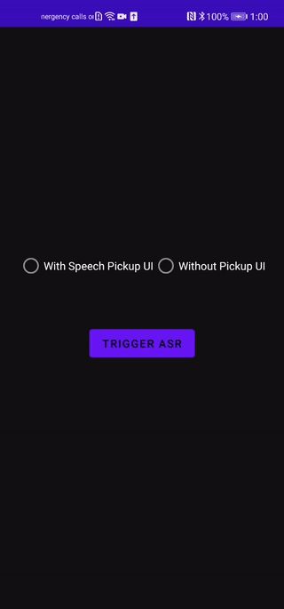
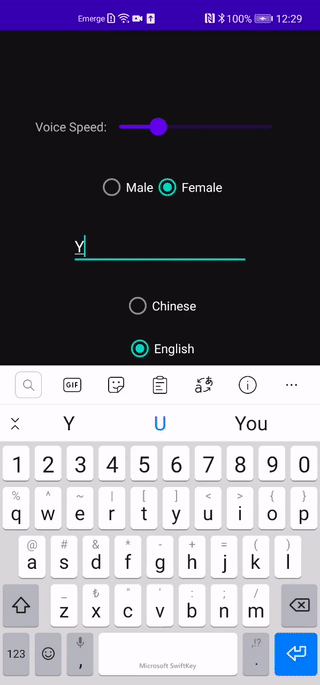

# ASR&TTS Codelabs

 

<table align="center">
  <tr>
    <td style="text-align:center"><b>Automatic Speech Recognition (ASR)</b> </td>
    <td style="text-align:center"><b>Text-to-Speech (TTS)</b></td>
  </tr>
  <tr>
    <td style="text-align:center"></td>
    <td style="text-align:center"></td>
  </tr>
</table>

It's an Android codelabs project that shows **Automatic Speech Recognition (ASR)** and **Text-to-Speech (TTS)** capabilities under the one test app. This repo would be updated as the new versions come.

You can also check the articles below that give you the idea of what TTS and ASR are;

🤖**ASR**: [The robots can understand us now](https://medium.com/huawei-developers/the-robots-can-understand-us-now-c55a1ad073ac)

🤖**TTS**: [The one TTS app to rule them all](https://medium.com/huawei-developers/the-one-tts-app-to-rule-them-all-c2b75d26262f)